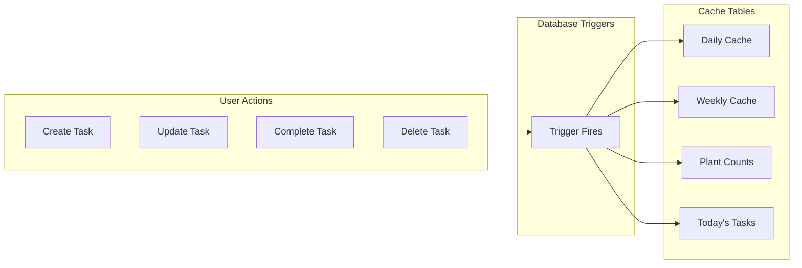

# 🌱 Garden Task Cache System

<div align="center">


**Pre-computed task data storage for dramatically improved performance by avoiding expensive recalculations on every request.**

</div>

---

## 📋 Overview

The Garden Task Cache system stores pre-computed task statistics in the database to dramatically improve performance. Instead of calculating task counts, completion rates, and weekly statistics on every request, the data is cached and updated automatically when underlying data changes.

### Cache Tables

| Table | Purpose |
|-------|---------|
| `garden_task_daily_cache` | Daily task statistics (due/completed counts) |
| `garden_task_weekly_cache` | Weekly task breakdowns by type and day |
| `garden_plant_task_counts_cache` | Task counts per plant |
| `garden_task_occurrences_today_cache` | Denormalized today's occurrences for fast access |

---

## 🚀 Quick Start

### 1. Run the Migration

```sql
-- Execute the migration file
\i supabase/003_garden_task_cache.sql
```

### 2. Initialize Cache

```sql
-- Populate cache for all existing gardens
SELECT initialize_garden_task_cache();
```

### 3. Done!

The cache is now active. It will automatically:
- ✅ Update when tasks are created/modified/deleted
- ✅ Update when task occurrences change
- ✅ Clean up old entries after 7 days

---

## ⚙️ How It Works

### Automatic Cache Refresh



Database triggers automatically fire on data changes:

| Event | Trigger Action |
|-------|----------------|
| Task occurrence INSERT/UPDATE/DELETE | Refresh related caches |
| Task INSERT/UPDATE/DELETE | Refresh related caches |
| Task progress update | Refresh daily and today's caches |

### Manual Cache Refresh

For cases where you need to force a refresh:

```typescript
import { refreshGardenTaskCache } from '@/lib/gardens'

// Refresh cache for a specific garden
await refreshGardenTaskCache(gardenId)
```

---

## 📊 Cache Usage

### Available Functions

```typescript
// Get today's progress (cached)
const progress = await getGardenTodayProgressCached(gardenId)
// Returns: { due: 5, completed: 3, total: 12 }

// Get progress for multiple gardens (batched)
const progressMap = await getGardensTodayProgressBatchCached(gardenIds)
// Returns: Map<gardenId, { due, completed, total }>

// Get today's task occurrences (cached)
const tasks = await getGardenTodayOccurrencesCached(gardenId)
// Returns: Array of task occurrences with plant info

// Get weekly statistics (cached)
const stats = await getGardenWeeklyStatsCached(gardenId, weekStartDate)
// Returns: { byDay: [2,3,1,0,4,2,1], byType: { water: 5, fertilize: 2 } }

// Get plant task counts (cached)
const counts = await getGardenPlantTaskCountsCached(gardenId)
// Returns: Map<gardenPlantId, { taskCount: 3, dueToday: 1 }>
```

### Fallback Behavior

All cache functions automatically fall back to computing from source data if:
- Cache is empty (new garden)
- Cache is stale (shouldn't happen with triggers)
- Cache table doesn't exist

```typescript
// This always works, with or without cache
const progress = await getGardenTodayProgressCached(gardenId)
// Uses cache if available, computes if not
```

---

## 🔄 Realtime Updates

The cache system is designed to work seamlessly with realtime updates:

| Feature | Behavior |
|---------|----------|
| **Immediate UI Updates** | Optimistic updates show instantly |
| **Realtime Broadcasts** | Continue to work as before |
| **Cache Refresh** | Happens in background (non-blocking) |
| **Sync** | Cache catches up asynchronously |

### Example: Completing a Task

```typescript
// User clicks "Complete"
await progressTaskOccurrence(occurrenceId, 'complete')

// What happens:
// 1. Database is updated immediately
// 2. Realtime broadcast sent to other clients
// 3. UI updates with optimistic state
// 4. Cache refresh runs in background
// 5. Next page load has fresh cache
```

---

## ⚡ Performance Benefits

### Before Cache System

```
Garden List Page (10 gardens):
  - 10 separate queries for progress
  - Each query: 50-200ms
  - Total: 500-2000ms

Garden Dashboard:
  - Query for today's tasks: 200-500ms
  - Query for weekly stats: 150-300ms
  - Query for plant counts: 100-200ms
  - Total: 450-1000ms
```

### After Cache System

```
Garden List Page (10 gardens):
  - 1 batch query from cache
  - Total: 30-80ms ✨

Garden Dashboard:
  - Read from cache: 20-50ms each
  - Total: 60-150ms ✨
```

### Improvement Summary

| Metric | Before | After | Speedup |
|--------|--------|-------|---------|
| Garden List | ~1200ms | ~50ms | **24x** |
| Dashboard | ~700ms | ~100ms | **7x** |
| Weekly View | ~400ms | ~40ms | **10x** |

---

## 🛠️ Maintenance

### Automatic Cleanup

Old cache entries (older than 7 days) are automatically cleaned up. You can trigger this manually:

```sql
SELECT cleanup_old_garden_task_cache();
```

### Scheduled Cleanup

Set up a daily cleanup job (recommended):

```sql
-- Using pg_cron
SELECT cron.schedule(
  'cleanup-task-cache',
  '0 4 * * *',  -- 4 AM daily
  'SELECT cleanup_old_garden_task_cache()'
);
```

### Monitoring

Check cache health:

```sql
-- Cache size by table
SELECT 
  relname as table_name,
  n_live_tup as row_count
FROM pg_stat_user_tables
WHERE relname LIKE 'garden_task%cache';

-- Recent cache updates
SELECT 
  garden_id,
  cache_date,
  updated_at
FROM garden_task_daily_cache
ORDER BY updated_at DESC
LIMIT 5;
```

### Troubleshooting

**Cache seems stale:**

```sql
-- Force refresh for a garden
SELECT refresh_garden_task_cache('garden-id-here', CURRENT_DATE);
```

**Cache not updating:**

```sql
-- Check if triggers exist
SELECT tgname, tgenabled 
FROM pg_trigger 
WHERE tgname LIKE '%task%cache%';
```

**Need to rebuild all caches:**

```sql
-- Clear and reinitialize (use with caution)
TRUNCATE garden_task_daily_cache CASCADE;
TRUNCATE garden_task_weekly_cache CASCADE;
TRUNCATE garden_plant_task_counts_cache CASCADE;
TRUNCATE garden_task_occurrences_today_cache CASCADE;
SELECT initialize_garden_task_cache();
```

---

## 📁 Related Files

| File | Description |
|------|-------------|
| `supabase/003_garden_task_cache.sql` | Migration with tables, functions, triggers |
| `src/lib/gardens.ts` | TypeScript cache functions |
| `src/pages/GardenListPage.tsx` | Uses batch cache for progress |
| `src/pages/GardenDashboardPage.tsx` | Uses multiple cache functions |

---

<div align="center">

**Part of the Aphylia garden management system** 🌿

[**Technical Documentation**](./README.md) • [**Cache Implementation Details**](./CACHE_IMPLEMENTATION.md)

</div>
