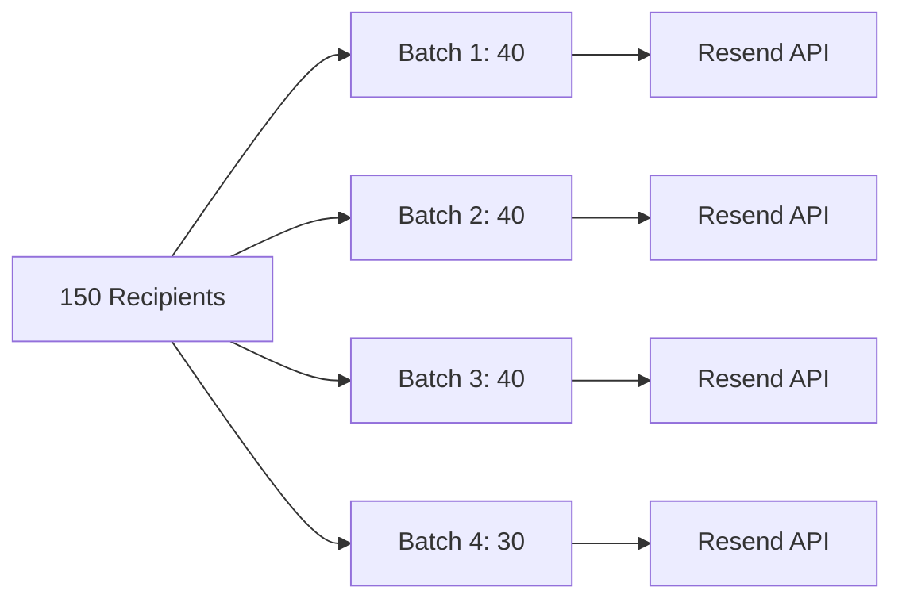

# 📨 Email Campaign Runner Edge Function

<div align="center">


**Scans for due email campaigns and sends templated emails to users using Resend with personalization support.**

</div>

---

## 📋 Overview

This Supabase Edge Function automates email campaigns for Aphylia. It:

- Scans the `admin_email_campaigns` table for scheduled campaigns
- Sends personalized emails to all users (or filtered recipients)
- Supports `{{user}}` placeholders for personalization
- Processes in batches for efficiency
- Logs results for monitoring

---

## ⚙️ Environment Variables

Configure these in the Supabase dashboard under **Project Settings → Functions → email-campaign-runner → Environment variables**:

| Variable | Required | Description |
|----------|----------|-------------|
| `SUPABASE_URL` | ✅ | Supabase project URL (auto-injected) |
| `SUPABASE_SERVICE_ROLE_KEY` | ✅ | Service role key for database access |
| `RESEND_API_KEY` | ✅ | Resend API key (or `EMAIL_CAMPAIGN_RESEND_KEY`) |
| `EMAIL_CAMPAIGN_FROM` | ❌ | From header (e.g., `Aphylia <info@aphylia.app>`) |
| `EMAIL_CAMPAIGN_REPLY_TO` | ❌ | Reply-to email address |
| `EMAIL_CAMPAIGN_BATCH_SIZE` | ❌ | Max recipients per batch (default: 40, max: 100) |

---

## 🚀 Deployment

### Deploy the Function

```bash
# Deploy to your Supabase project
supabase functions deploy email-campaign-runner \
  --project-ref <your-project-ref> \
  --no-verify-jwt
```

### Set Environment Variables

After deploying, configure the environment variables in the Supabase dashboard:

1. Go to **Project Settings → Functions**
2. Click on `email-campaign-runner`
3. Add the required environment variables

---

## 🧪 Local Development

### Create Environment File

Create `supabase/functions/.env.local`:

```bash
SUPABASE_URL=https://your-project.supabase.co
SUPABASE_SERVICE_ROLE_KEY=your-service-role-key
RESEND_API_KEY=re_xxxxxxxxxxxxx
EMAIL_CAMPAIGN_FROM=Aphylia <info@aphylia.app>
EMAIL_CAMPAIGN_BATCH_SIZE=10
```

### Serve Locally

```bash
supabase functions serve email-campaign-runner --env-file ./functions/.env.local
```

---

## 📖 Usage

### Invoke the Function

```bash
curl -X POST \
  -H "apikey: $SUPABASE_SERVICE_ROLE_KEY" \
  -H "Authorization: Bearer $SUPABASE_SERVICE_ROLE_KEY" \
  -H "Content-Type: application/json" \
  "https://<project-ref>.supabase.co/functions/v1/email-campaign-runner" \
  -d '{"campaignId": "<uuid>"}'
```

### Request Payload

| Field | Type | Description |
|-------|------|-------------|
| `campaignId` | string | Process a specific campaign (even if draft) |
| `campaignLimit` | number | Max campaigns to process per run (default: 1) |
| `recipientLimit` | number | Safety cap on recipients processed |
| `batchSize` | number | Override batch size (1-100) |

### Examples

**Process a specific campaign:**

```bash
curl -X POST ... -d '{"campaignId": "abc-123-def"}'
```

**Process multiple scheduled campaigns:**

```bash
curl -X POST ... -d '{"campaignLimit": 5}'
```

**Test with limited recipients:**

```bash
curl -X POST ... -d '{"campaignId": "abc-123-def", "recipientLimit": 10}'
```

---

## 📊 Response Format

```json
{
  "campaigns": [
    {
      "id": "campaign-uuid",
      "subject": "Welcome to Aphylia!",
      "recipientCount": 150,
      "batchCount": 4,
      "successCount": 148,
      "failureCount": 2,
      "batches": [
        { "batchIndex": 0, "sent": 40, "success": true },
        { "batchIndex": 1, "sent": 40, "success": true },
        { "batchIndex": 2, "sent": 40, "success": true },
        { "batchIndex": 3, "sent": 30, "success": true }
      ],
      "failures": [
        { "email": "bounced@example.com", "reason": "Mailbox not found" }
      ]
    }
  ],
  "processedAt": "2024-01-15T10:30:00Z"
}
```

---

## 🔄 Campaign Table Schema

The function reads from `admin_email_campaigns`:

| Column | Type | Description |
|--------|------|-------------|
| `id` | UUID | Campaign ID |
| `subject` | TEXT | Email subject line |
| `body_html` | TEXT | HTML email body |
| `status` | TEXT | `draft`, `scheduled`, `sending`, `sent`, `failed` |
| `scheduled_at` | TIMESTAMP | When to send (null = draft) |
| `sent_at` | TIMESTAMP | When sent |
| `recipient_count` | INTEGER | Number of recipients |
| `created_at` | TIMESTAMP | Creation time |

---

## ✨ Personalization

The function supports `{{user}}` placeholders in both subject and body:

**Template:**

```html
<h1>Hello {{user}}!</h1>
<p>Welcome to Aphylia's gardening community.</p>
```

**Rendered:**

```html
<h1>Hello John!</h1>
<p>Welcome to Aphylia's gardening community.</p>
```

The `{{user}}` placeholder is replaced with the recipient's display name from their profile.

---

## 📈 Batch Processing

Emails are sent in batches to respect rate limits and ensure reliability:

| Setting | Default | Max |
|---------|---------|-----|
| Batch Size | 40 | 100 |

### How Batching Works



---

## ⏰ Scheduled Execution

### Using Supabase Cron (pg_cron)

```sql
-- Run every hour to check for scheduled campaigns
SELECT cron.schedule(
  'run-email-campaigns',
  '0 * * * *',  -- Every hour
  $$
  SELECT net.http_post(
    url := 'https://<project-ref>.supabase.co/functions/v1/email-campaign-runner',
    headers := '{"Authorization": "Bearer <service-role-key>", "Content-Type": "application/json"}'::jsonb,
    body := '{"campaignLimit": 5}'::jsonb
  )
  $$
);
```

### Using External Cron

```bash
# Crontab entry - run every hour
0 * * * * curl -X POST -H "Authorization: Bearer $KEY" https://.../email-campaign-runner
```

---

## 🐛 Troubleshooting

### Common Issues

**Emails not sending:**
- Check `RESEND_API_KEY` is valid
- Verify from domain is verified in Resend
- Check campaign status is `scheduled`

**Rate limiting:**
- Reduce `EMAIL_CAMPAIGN_BATCH_SIZE`
- Add delay between function invocations

**Missing recipients:**
- Ensure users have verified emails
- Check user profiles exist in database

### View Logs

```bash
# View function logs
supabase functions logs email-campaign-runner --project-ref <your-project-ref>
```

---

## 📚 Resources

| Resource | Link |
|----------|------|
| Supabase Edge Functions | [Documentation](https://supabase.com/docs/guides/functions) |
| Resend Batch API | [Documentation](https://resend.com/docs/api-reference/emails/send-batch-emails) |
| pg_cron Extension | [Documentation](https://supabase.com/docs/guides/database/extensions/pg_cron) |

---

<div align="center">

**Part of Aphylia** 🌿

[**Technical Documentation**](../../README.md) • [**Main README**](../../../README.md)

</div>
